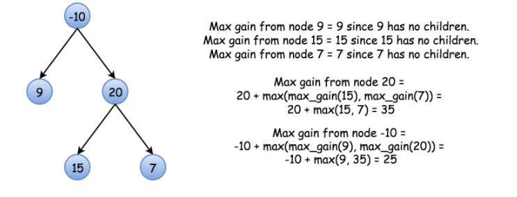
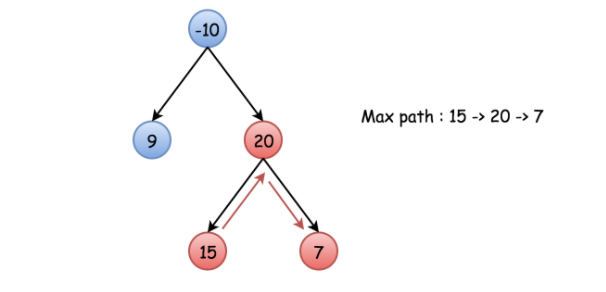

## 124. 二叉树中的最大路径和 Binary Tree Maximum Path Sum

给定一个非空二叉树，返回其最大路径和。

本题中，路径被定义为一条从树中任意节点出发，达到任意节点的序列。该路径至少包含一个节点，且不一定经过根节点。

示例 1:

```text
输入: [1,2,3]

       1
      / \
     2   3

输出: 6
```

示例 2:

```text
输入: [-10,9,20,null,null,15,7]

   -10
   / \
  9  20
    /  \
   15   7

输出: 42
```

**方法1： 递归**

**思路**

首先，考虑实现一个简化的函数 maxGain(node) ，参数是一个顶点，计算它及其子树的最大贡献。

>换句话说，就是计算包含这个顶点的最大权值路径。



因此如果可知最后的最大路径和包含 `root` ，那么答案就是 `maxGain(root)`。

然而，最大路径可能并不包括根节点，比如下面的这棵树：



这意味着我们要修改上面的函数，在每一步都检查哪种选择更好：是继续当前路径或者以当前节点作为最高节点计算新的路径.

**算法实现描述**

- 初始化 `maxSum` 为最小可能的整数并调用函数 `maxGain(node = root)`。

- 实现 `maxGain(node)` 检查是继续旧路径还是开始新路径：
  1. 边界情况：如果节点为空，那么最大权值是 0 。
  2. 对该节点的所有孩子递归调用 `maxGain`，计算从左右子树的最大权值：leftGain = max(maxGain(node.left), 0) 和 rightGain = max(maxGain(node.right), 0)。
  3. 检查是维护旧路径还是创建新路径。创建新路径的权值是：`newPathSum = node.val + leftGain + rightGain`，当新路径更好的时候更新 `maxSum`。
  4. 对于递归返回的到当前节点的一条最大路径，计算结果为：`node.val + max(leftGain, rightGain)`。

代码实现

```java
public class Solution {

    int maxNum = Integer.MIN_VALUE;

    private int maxGain(TreeNode node) {
        if (node == null) {
            return 0;
        }

        // 左右两个子树的最大路径和
        int leftGain = Math.max(maxGain(node.left), 0);
        int rightGain = Math.max(maxGain(node.right), 0);

        // 当前节点的最大路径和
        int newPathSum = node.val + leftGain + rightGain;

        // 更新为两者中较大的那个
        maxNum = Math.max(newPathSum, maxNum);
        // 否则进行递归处理，获取最大路径和值
        return node.val + Math.max(leftGain, rightGain);
    }

    public int maxPathSum(TreeNode root) {
        maxGain(root);
        return maxNum;
    }


    /**
     * Definition for a binary tree node
     */
    class TreeNode {
        int val;
        TreeNode left;
        TreeNode right;

        TreeNode(int x) {
            val = x;
        }
    }
}
```

**复杂度分析**

- 时间复杂度：`O(N)` 其中 N 是结点个数。我们对每个节点访问不超过 2 次。
- 空间复杂度：`O(log(N))`。我们需要一个大小与树的高度相等的栈开销，对于二叉树空间开销是 `O(log(N))`


