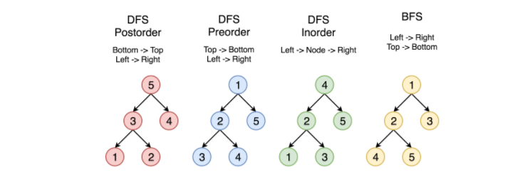

## 144. 二叉树的前序遍历

给定一个二叉树，返回它的 前序 遍历。

示例:

```text
输入: [1,null,2,3]  
   1
    \
     2
    /
   3 

输出: [1,2,3]
```

进阶: 递归算法很简单，你可以通过迭代算法完成吗？

**方法一：递归**

**代码实现**

```java
public class Solution {

    public List<Integer> preorderTraversal(TreeNode root) {
        List<Integer> ans = new ArrayList<>();
        preOrder(ans, root);
        return ans;
    }

    private void preOrder(List<Integer> ans, TreeNode root) {
        if (root != null) {
            ans.add(root.val);
            preOrder(ans, root.left);
            preOrder(ans, root.right);
        }
    }

    public class TreeNode {
        int val;
        TreeNode left;
        TreeNode right;
        TreeNode(int x) {
            val = x;
        }
    }
}
```

有两种通用的遍历树的策略：

- 深度优先搜索（DFS）

  在这个策略中，我们采用`深度`作为优先级，以便从跟开始一直到达某个确定的叶子，然后再返回根到达另一个分支。

  深度优先搜索策略又可以根据根节点、左孩子和右孩子的相对顺序被细分为`前序遍历`，`中序遍历`和`后序遍历`。

- 宽度优先搜索（BFS）

  我们按照高度顺序一层一层的访问整棵树，高层次的节点将会比低层次的节点先被访问到。

下图中的顶点按照访问的顺序编号，按照 1-2-3-4-5 的顺序来比较不同的策略。



本问题就是用宽度优先搜索遍历来划分层次：`[[1], [2, 3], [4, 5]]`。

**方法 2：迭代**

首先，定义树的存储结构 `TreeNode`。

```java
/* Definition for a binary tree node. */
public class TreeNode {
  int val;
  TreeNode left;
  TreeNode right;

  TreeNode(int x) {
    val = x;
  }
}
```

从根节点开始，每次迭代弹出当前栈顶元素，并将其孩子节点压入栈中，`先压右孩子``再压左孩子`。

在这个算法中，输出到最终结果的顺序按照 `Top->Bottom` 和 `Left->Right`，符合前序遍历的顺序。

**代码实现**

```java
public class Solution02 {

    public List<Integer> preorderTraversal(TreeNode root) {
        LinkedList<TreeNode> stack = new LinkedList<>();
        LinkedList<Integer> output = new LinkedList<>();

        if (root == null) {
            return output;
        }
        stack.add(root);
        while (!stack.isEmpty()) {
            TreeNode cur = stack.pollLast();
            output.add(cur.val);
            if (root.right != null) {
                stack.add(root.right);
            }
            if (root.left != null) {
                stack.add(root.left);
            }
        }

        return output;
    }

    /**
     * Definition for a binary tree node
     */
    class TreeNode {
        int val;
        TreeNode left;
        TreeNode right;

        TreeNode(int x) {
            val = x;
        }
    }
}
```

**算法复杂度**

- 时间复杂度：访问每个节点恰好一次，时间复杂度为 `O(N)` ，其中 `N` 是节点的个数，也就是树的大小。
- 空间复杂度：取决于树的结构，最坏情况存储整棵树，因此空间复杂度是 `O(N)`。


