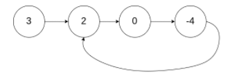
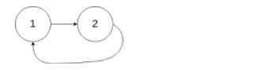

## 142. Linked List Cycle II 环形链表 II

给定一个链表，返回链表开始入环的第一个节点。 如果链表无环，则返回 null。

为了表示给定链表中的环，我们使用整数 pos 来表示链表尾连接到链表中的位置（索引从 0 开始）。 如果 pos 是 -1，则在该链表中没有环。

>说明：不允许修改给定的链表。

示例1：

```text
输入：head = [3,2,0,-4], pos = 1
输出：tail connects to node index 1
解释：链表中有一个环，其尾部连接到第二个节点。
```



示例2：

```text
输入：head = [1,2], pos = 0
输出：tail connects to node index 0
解释：链表中有一个环，其尾部连接到第一个节点。
```




示例3：

```text
输入：head = [1], pos = -1
输出：no cycle
解释：链表中没有环。
```


**方法 1：哈希表**

**想法**

如果我们用一个 Set 保存已经访问过的节点，我们可以遍历整个列表并返回第一个出现重复的节点。

**算法**

首先，我们分配一个 Set 去保存所有的列表节点。我们逐一遍历列表，检查当前节点是否出现过，如果节点已经出现过，那么一定形成了环且它是环的入口。否则如果有其他点是环的入口，我们应该先访问到其他节点而不是这个节点。其他情况，没有成环则直接返回 null 。

算法会在遍历有限个节点后终止，这是因为输入列表会被分成两类：成环的和不成环的。
- 一个不成环的列表在遍历完所有节点后会到达 null - 即链表的最后一个元素后停止。
- 一个成环列表可以想象成是一个不成环列表将最后一个 null 元素换成环的入口。

如果 while 循环终止，我们返回 null 因为我们已经将所有的节点遍历了一遍且没有遇到重复的节点，这种情况下，列表是不成环的。对于循环列表， while 循环永远不会停止，但在某个节点上， if 条件会被满足并导致函数的退出

**代码实现**

```java
public class Solution {

    public ListNode detectCycle(ListNode head) {
        HashSet<ListNode> visited = new HashSet<>();

        while (head != null) {
            // 有环链表的退出节点
            if (visited.contains(head)) {
                return head;
            }

            visited.add(head);
            head = head.next;
        }
        // 代码走在这里，代表链表没有环
        return null;
    }

    static class ListNode {
        int val;
        ListNode next;
        ListNode(int x) {
            val = x;
            next = null;
        }
    }
}
```

**复杂度分析**

- 时间复杂度：O(n)

不管是成环还是不成环的输入，算法肯定都只会访问每个节点一次。对于非成环列表这是显而易见的，因为第 `n` 个节点指向 `null` ，这会让循环退出。对于循环列表， if 条件满足时会导致函数的退出，因为它指向了某个已经访问过的节点。两种情况下，访问的节点数最多都是 `n` 个，所以运行时间跟节点数目成线性关系。

- 空间复杂度：O(n)

不管成环或者不成欢的输入，我们都需要将每个节点插入 Set 中一次。两者唯一的区别是最后访问的节点后是 null 还是一个已经访问过的节点。因此，由于 Set 包含 `n` 个不同的节点，所需空间与节点数目也是线性关系的。


