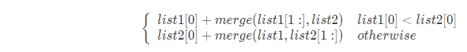

## 21. 合并两个有序链表

将两个有序链表合并为一个新的有序链表并返回。新链表是通过拼接给定的两个链表的
所有节点组成的。 

示例：

```
输入：1->2->4, 1->3->4
输出：1->1->2->3->4->4
```

**方法 1：递归**

**想法**

我们可以如下递归地定义在两个链表里的 merge 操作（忽略边界情况，比如空链表等）:



也就是说，两个链表头部较小的一个与剩下元素的 `merge` 操作结果合并。

**算法**

我们直接将以上递归过程建模，首先考虑边界情况。 特殊的，如果 l1 或者 l2 一开始就是 null ，
那么没有任何操作需要合并，所以我们只需要返回非空链表。否则，我们要判断 l1 和 l2 哪一个的头元素更小，
然后递归地决定下一个添加到结果里的值。如果两个链表都是空的，那么过程终止，所以递归过程最终一定会终止。

**代码**

```java
public class Solution {

    public ListNode mergeTwoLists(ListNode l1, ListNode l2) {
        if (l1 == null) {
            return l2;
        } else if (l2 == null) {
            return l1;
        } else if (l1.val < l2.val) {
            l1.next = mergeTwoLists(l1.next, l2);
            return l1;
        } else {
            // l1.val > l2.val
            l2.next = mergeTwoLists(l1, l2.next);
            return l2;
        }
    }

    class ListNode {
        int val;
        ListNode next;
    }
}

```

**复杂度分析**

- 时间复杂度：O(n+m)。 因为每次调用递归都会去掉 l1 或者 l2 的头元素（直到至少有一个链表为空），函数 mergeTwoList 中只会遍历每个元素一次。
所以，时间复杂度与合并后的链表长度为线性关系。

- 空间复杂度: O(n+m)。调用 mergeTwoLists 退出时 l1 和 l2 中每个元素都一定已经被遍历过了，所以 n + m 个栈帧会消耗 O(n + m) 的空间
                


